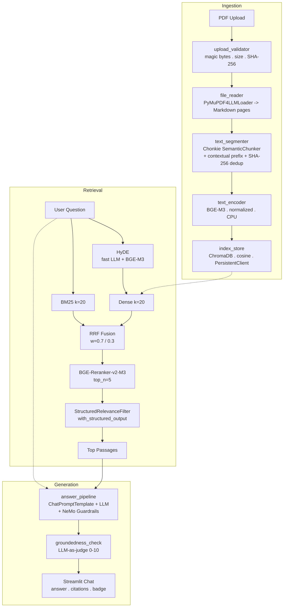

# RAG Knowledge Assistant

> Answer questions **only** from your uploaded PDFs - with source citations,
> groundedness scoring, and guardrailed generation.

[](https://www.python.org/downloads/)
[](https://streamlit.io)
[](https://python.langchain.com)
[](https://www.trychroma.com/)
[](LICENSE)
[](https://github.com/astral-sh/uv)

---

## What Problem This Solves

Standard LLMs hallucinate. Fine-tuning is expensive and goes stale. This
system takes a different path: **every answer is forced to come from passages
your retrieval pipeline actually found in your PDFs**. If the documents don't
contain the answer, the system says so instead of making something up.

The three failure modes it specifically engineers against:

| Failure mode | How it is addressed here |
|---|---|
| Retrieval misses the right passage | Hybrid dense + sparse (BM25) retrieval fused via RRF, then cross-encoder reranking |
| LLM drifts outside retrieved context | System prompt enforces document-only answers; groundedness scorer flags drift 0-10 |
| Prompt/file injection attacks | Magic-byte upload validation + NeMo Guardrails on input and output |

---

## Architecture



---

## Tech Stack

| Layer | Choice | Why |
|---|---|---|
| UI | Streamlit | Zero-boilerplate chat + file upload |
| Orchestration | LangChain 1.x LCEL | Composable, type-safe chains |
| LLM routing | LiteLLM (`ChatLiteLLM`) | One `.env` line to swap provider |
| Embeddings | BAAI/bge-m3 (CPU, 2.27 GB) | Top open-source dense encoder; cosine-normalized |
| Reranker | BAAI/bge-reranker-v2-m3 (CPU, ~1 GB) | Highest-ROI retrieval improvement; no extra API call |
| Vector store | ChromaDB persistent, cosine | Local-first; no managed infra needed |
| Keyword search | rank-bm25 | Catches exact matches that vector search misses |
| Chunking | Chonkie SemanticChunker + Model2Vec | Semantic boundaries in milliseconds (505 KB model) |
| PDF loader | langchain-pymupdf4llm | Markdown output, table-aware, selective OCR |
| Guardrails | NeMo Guardrails (RunnableRails) | Input + output rails + retrieval taint detection |
| Evaluation | RAGAS (offline CI gate) | Faithfulness, answer relevancy, context precision |
| Config | pydantic-settings | Type-validated, `.env`-driven, no magic strings |
| Package manager | uv | Deterministic installs via `uv.lock` |

---

## Prerequisites

- **Python 3.12+** (`.python-version` pins this).
- **~4 GB free disk** for model cache on first run:
  - BGE-M3: 2.27 GB
  - BGE-Reranker-v2-M3: ~1 GB
  - Chonkie Model2Vec: 505 KB
  - All cached to `~/.cache/huggingface/` - subsequent runs skip download.
- **One LLM API key** for your chosen cloud provider (default: NVIDIA NIM - free tier at [build.nvidia.com](https://build.nvidia.com)).

Install `uv` (the only global install required):

```bash
# macOS / Linux
curl -LsSf https://astral.sh/uv/install.sh | sh

# Windows (PowerShell)
powershell -ExecutionPolicy ByPass -c "irm https://astral.sh/uv/install.ps1 | iex"
```

---

## Quick Start

### 1. Clone and install

```bash
git clone https://github.com/sayedabutahir2026/ai-mini-assistant.git
cd ai-mini-assistant
uv sync          # reads pyproject.toml + uv.lock, creates .venv automatically
```

### 2. Configure environment

Copy `.env.example` to `.env` (never commit `.env`):

```dotenv
# Minimum required - NVIDIA NIM (free tier)
NVIDIA_API_KEY=nvapi-xxxxxxxxxxxxxxxxxxxxxxxxxxxxxxxxxxxxxxxxxxxx
PRIMARY_MODEL_NAME=nvidia_nim/nvidia/nemotron-3.5-lightning-30b-a3b
FAST_MODEL_NAME=nvidia_nim/nvidia/nemotron-3.5-lightning-30b-a3b

# Production safety
ENABLE_CONTENT_SCANNING=false   # set true in production

# Telemetry opt-out
RAGAS_DO_NOT_TRACK=true
LANGCHAIN_TRACING_V2=false
```

> **Get an NVIDIA NIM key:** [build.nvidia.com](https://build.nvidia.com) -> any model -> *Get API Key*.
> One key covers all NIM models.

Validate your setup before running:

```bash
uv run python -c "from rag.settings import validate_environment; validate_environment(); print('OK')"
```

### 3. Run

```bash
uv run streamlit run app.py
# Opens http://localhost:8501
```

### 4. Use it

1. **Upload** PDFs via the sidebar (max 50 MB each, text-based PDFs work best).
2. Click **Index Files** - progress shows: reading -> segmenting -> encoding -> storing.
3. When **Index ready - N passages** appears, type a question in the chat.
4. Expand **Source Citations** to see which passages and pages the answer came from.
5. Check the **Groundedness: X/10** badge - below 6 means verify against citations.

> Re-index after uploading new files. The sidebar warns when the index is > 24 h old.

---

## Deployment

### Streamlit Community Cloud

1. Push to GitHub (`.env`, `data/`, `index_store/` must be in `.gitignore`).
2. New app -> point to `app.py`.
3. Paste secrets as TOML (never upload `.env`):

```toml
NVIDIA_API_KEY = "nvapi-..."
PRIMARY_MODEL_NAME = "nvidia_nim/nvidia/nemotron-3.5-lightning-30b-a3b"
FAST_MODEL_NAME    = "nvidia_nim/nvidia/nemotron-3.5-lightning-30b-a3b"
ENABLE_CONTENT_SCANNING = "true"
```

4. First cold start downloads BGE models (~3.3 GB) - expect 30-60 s.
   Subsequent runs use Streamlit's cache.

### Docker

```dockerfile
FROM python:3.12-slim
WORKDIR /app
COPY . .
RUN pip install uv && uv sync --frozen
EXPOSE 8501
CMD ["uv", "run", "streamlit", "run", "app.py",
     "--server.port=8501", "--server.address=0.0.0.0"]
```

Mount `index_store/` and `file_audit.json` as volumes if index survival
across restarts matters.

---

## Development

```bash
# Lint and format (ruff, line-length 100, py312 target)
uv run ruff check .
uv run ruff format .

# Run eval gate
uv run python eval/run_quality_checks.py

# Fresh start - wipe index and audit log
rm -rf index_store/ file_audit.json
```

**Conventions for contributors:**

- All constants -> `rag/settings.py`. No inline magic numbers or strings.
- All exceptions -> inherit from `RagError` (`rag/errors.py`). Catch by type.
- Logging -> `INFO` for lifecycle events, `DEBUG` for retrieval decisions.
  Mirror important steps in Streamlit status widgets so users see progress.
- `model_config = SettingsConfigDict(extra="ignore")` - unknown env vars are
  silently ignored, so adding new vars never breaks existing deployments.

See [CONTRIBUTING.md](CONTRIBUTING.md) for branch naming, PR checklist, and
how to add a new LLM provider.

---

## Roadmap

- [ ] Incremental indexing - skip unchanged passages via content hash (avoid full wipe)
- [ ] Multi-collection support - per-user or per-project indexes
- [ ] Streaming answers - `chain.astream()` in Streamlit chat
- [ ] Redis-backed rate limiter - stateful throttle for multi-replica deployments
- [ ] Docker Compose with Ollama - fully offline mode, no cloud API key required
- [ ] CI workflow - run `eval/run_quality_checks.py` as a deployment gate on PR merge

---

## Acknowledgements

- [BAAI](https://huggingface.co/BAAI) - BGE-M3 and BGE-Reranker-v2-M3
- [Chonkie](https://github.com/chonkie-ai/chonkie) - fast semantic chunking with Model2Vec
- [ChromaDB](https://www.trychroma.com/), [LangChain](https://python.langchain.com/),
  [LiteLLM](https://github.com/BerriAI/litellm)
- [NVIDIA NeMo Guardrails](https://github.com/NVIDIA/NeMo-Guardrails) - Apache 2.0
- [RAGAS](https://docs.ragas.io/) - offline RAG evaluation framework

---

## License

MIT - see [`LICENSE`](LICENSE).


---
